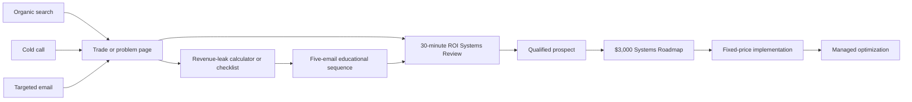
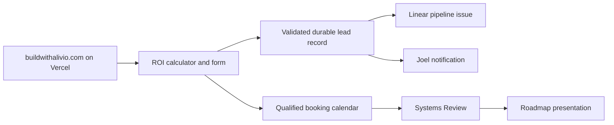

# Build With Alivio — Launch Design

**Owner:** Joel Carias  
**Brand:** Alivio Studio  
**Canonical domain:** `buildwithalivio.com`  
**Market:** US home-service companies  
**Acquisition model:** Organic search, founder-led cold calls, and targeted email  
**Approved:** 2026-08-06

## 1. Purpose

Launch the existing Alivio Studio Vercel website as a credible, measurable sales
system for US home-service companies. The launch must explain how Alivio finds
revenue leakage, prioritizes the fastest-payback improvements, and measures the
return on the client's investment.

This is not a new visual rebuild. The approved design, identity, and static site
at `alivio-studio.vercel.app` are the foundation. The work is positioning,
proof, conversion infrastructure, content, measurement, and launch operations.

## 2. Decisions

- The company remains **Alivio Studio**.
- **Build With Alivio** is the domain, campaign identity, and principal call to
  action; the logo is not renamed.
- `buildwithalivio.com` becomes the canonical public domain.
- The first market is US home-service operators, beginning with HVAC and
  expanding to plumbing, electrical, roofing, and adjacent trades.
- The website may accept qualified clients nationwide. Initial outbound lists
  concentrate on New York and the Northeast because Bravo Mechanical provides
  relevant proof.
- The first sales conversion is a free 30-minute Home Service ROI Systems
  Review.
- Qualified prospects progress to a paid roadmap before a substantial build.
- Acquisition uses organic search, manual cold calls, and low-volume
  personalized email. There is no paid advertising in the initial 90 days.
- Performance claims require evidence. Placeholder results, illustrative
  testimonials, and invented client outcomes are removed before launch.

## 3. Audit baseline

### Existing assets

- Six-page static Alivio Studio website deployed on Vercel.
- Strong visual system, brand marks, typography, animation, navigation, service
  taxonomy, process pages, and responsive layout.
- Clean local source at `/Users/joel/alivio-studio` linked to the Vercel project
  `alivio-studio`.
- Existing operations OS covering qualification, pipeline stages, pricing,
  delivery, communication, and reporting.
- A real home-services engagement: Bravo Mechanical website and CRM.
- Additional technical and creative work that may support credibility, including
  RLTRS, It's Lit Neon, and Elite Funding Solutions.

### Launch blockers found

- Contact and newsletter forms are demonstrations and do not submit.
- Phone number and social links are placeholders.
- `hello@alivio.studio` is not the approved launch address.
- Statistics, testimonials, and performance figures are illustrative or
  unverified.
- Privacy and terms pages do not exist.
- Social metadata, sitemap, robots file, canonical production URLs, conversion
  tracking, and security headers are missing.
- The current copy promises a 45-minute consultation, cancel-anytime retainers,
  phase-by-phase pricing, and four specialists on every engagement. Those claims
  conflict with the operating system and approved launch model.
- The current form does not collect the budget, authority, timing, lead-volume,
  or tool-stack information required to qualify a prospect.
- `aliviosearch.cloud` is registered in Hostinger and known to Vercel, but it is
  not connected to a website. Its name overlaps the Alivio Search recruitment
  brand and is unsuitable as the studio's primary domain.

## 4. Positioning

### Core promise

> Build With Alivio finds and fixes the places where home-service companies lose
> leads, estimates, jobs, and staff time—then measures the money recovered.

### Supporting message

> We connect your website, calls, leads, scheduling, follow-up, and CRM so fewer
> jobs disappear between systems.

### Financial outcomes

Alivio sells four outcomes rather than leading with technology:

1. More paid leads contacted.
2. More estimates followed up and closed.
3. Fewer appointments and callbacks lost.
4. Fewer administrative hours spent moving information between tools.

AI, automation, software, and web work are the means. Revenue recovery,
capacity, and operational visibility are the client-facing value.

## 5. ROI model

The ROI calculator and Systems Review use the prospect's own numbers. Every
assumption remains visible and editable.

```text
Additional monthly gross profit
= recovered opportunities
× booking rate
× close rate
× average job value
× gross margin
```

```text
Monthly labor savings
= hours eliminated
× fully loaded hourly cost
```

```text
Estimated payback period
= implementation investment
÷ monthly incremental gross profit and labor savings
```

The calculator presents conservative, expected, and upside scenarios. It does
not use universal conversion benchmarks as promises. A result is described as
an estimate until client analytics verify it.

### Implementation priority

1. **Recover existing demand:** missed calls, website enquiries, and after-hours
   leads already paid for.
2. **Reactivate opportunities:** unsold estimates, dormant leads, overdue
   maintenance, and renewal opportunities.
3. **Reduce administration:** repeated data entry, manual reminders, scheduling
   handoffs, and spreadsheet reconciliation.
4. **Improve future acquisition:** website, SEO, tracking, CRM, and long-term
   nurture after existing leakage is controlled.

### First 30-Day ROI Plan

The first implementation phase establishes:

- Baseline lead, response, booking, close, job-value, and margin measurements.
- End-to-end lead tracking.
- Immediate routing for new enquiries.
- Missed-call and lead-response workflows where the business has a lawful basis
  and valid consent for the channel used.
- Estimate follow-up.
- A dashboard showing opportunities recovered, bookings influenced, and time
  saved.

The client sees a measured before-and-after system rather than a collection of
installed tools.

## 6. Offer ladder

### 1. Home Service ROI Systems Review — free, 30 minutes

A qualification and diagnosis call. Alivio identifies the likely financial
leak, confirms decision authority, timeline, and investment fit, and decides
whether a paid roadmap is justified. It is not an unpaid consulting session.

### 2. Home Service Systems Roadmap — $3,000 fixed

Deliverables:

- Current website-to-job workflow map.
- Lead-leak and response-time assessment.
- Tool and integration inventory.
- Ranked automation opportunities.
- Recommended architecture.
- 60–90-day implementation sequence.
- ROI model and measurement plan.
- Fixed-price implementation options.

The client owns the roadmap and may stop after this engagement.

### 3. Fixed-price implementation — normally $8,000–$30,000

Possible scope includes conversion websites, CRM and lead routing, missed-call
response, qualification and nurture, scheduling, estimate follow-up, reminders,
integrations, and reporting. The SOW contains countable deliverables, exclusions,
two revision rounds, client inputs, and payment terms.

### 4. Managed optimization — $2,000–$5,000 per month

Three-month minimum. Scope may include monitoring, failure alerts, reporting,
and an agreed improvement backlog. The site must not advertise cancel-any-month
terms.

## 7. Site architecture

### Primary pages

- **Home:** ROI-first home-services positioning, revenue-leak framing, Bravo
  proof, solution overview, ROI calculator, and Systems Review CTA.
- **Home Services:** the complete website-to-job workflow and common leakage
  points.
- **HVAC:** Bravo-led page addressing missed calls, estimates, scheduling, CRM,
  maintenance, and review flows.
- **Plumbing, Electrical, Roofing:** added only when each page contains genuinely
  useful trade-specific material; no thin location or trade-page multiplication.
- **Solutions:** lead capture, missed-call response, qualification, follow-up,
  CRM and dispatch integrations, estimates, scheduling, reminders, conversion
  websites, reporting, and managed automation.
- **Work:** Bravo Mechanical first, with selected supporting builds that show
  technical depth without implying they are home-service projects.
- **ROI Systems Review:** calculator, qualification form, expectations, and
  booking flow.
- **Resources:** practical articles, checklists, comparisons, workflow guides,
  and implementation breakdowns.
- **About, Contact, Privacy, and Terms.**

### Funnel paths



Calls and emails point to the page matching the observed problem rather than the
generic homepage.

## 8. Qualification and lead handling

The review form collects:

- Name, company, role, trade, and service area.
- Team size and approximate monthly lead volume.
- Current website, CRM, phone, scheduling, and dispatch tools.
- The operational problem costing the most.
- Decision-maker status.
- Timeline.
- Investment range.
- Required privacy and contact consent.

Qualified prospects receive the booking path. Poor-fit or early-stage prospects
receive educational material without consuming a call.

The submission flow must validate server-side, resist spam, preserve the lead in
durable storage, notify Joel, and create a structured Linear pipeline issue. A
failed notification may not destroy a submission. Linear remains the pipeline
source of truth.

## 9. Proof strategy

### Bravo Mechanical

Primary HVAC proof. The launch may describe the verified website, CRM, customer
intake, and workflow work. It may not publish revenue, conversion, lead-response,
or time-saved figures until source data substantiates them.

### Supporting work

- **RLTRS:** complex platform, automation, data, and product capability.
- **It's Lit Neon or Elite Funding Solutions:** conversion-focused web,
  commerce, or campaign capability where the record supports the claim.

Supporting examples are labeled accurately and do not masquerade as
home-services outcomes. Client names are used under Joel's authorization.
Testimonials require the client's approved wording.

## 10. Organic acquisition

### Content pillars

- Lead capture and missed-call recovery.
- Estimate follow-up and dormant-lead reactivation.
- CRM, dispatch, scheduling, invoicing, and tool integration.
- Home-service website conversion and measurement.
- Practical AI readiness, cost, risk, and implementation.

### Cadence

- One substantive article or guide per week.
- One client or build breakdown per month.
- Three short LinkedIn posts derived from each article.
- One opted-in monthly email digest.
- Internal links from every resource to a relevant solution page and the ROI
  Systems Review.

The first 90 days are evaluated through indexing, qualified impressions,
rankings, engagement, and enquiries. Organic lead volume is not treated as an
immediate expectation.

## 11. Founder-led cold calls

- Begin with approximately 15 selected calls per day, four days per week.
- Start with Northeast HVAC and adjacent trades.
- Prioritize observable leakage: poor mobile website, no online booking, weak
  follow-up, disconnected tools, or reviews mentioning unanswered calls.
- Use a permission-based opener, one specific observation, one operational
  question, a financial implication, and an invitation to the ROI Systems
  Review.
- Follow on days 1, 3, 7, and 14, then stop.

Calls are manual and human. Alivio does not use prerecorded or AI-generated
voices for cold outreach. It maintains an entity-specific suppression list,
honors every do-not-call request, and checks federal and applicable state rules
before a campaign begins.

## 12. Targeted email

- Begin with approximately 10 researched, personalized emails per day.
- Send from `joel@buildwithalivio.com` with a monitored reply path.
- Use a company-specific observation and direct the prospect to the matching
  problem page.
- Use a four-message sequence: observation, useful diagnosis, relevant proof,
  and close-the-loop.
- Avoid bulk-purchased blasts and automated personalization that cannot be
  checked by a person.

Before sending, the domain must have SPF, DKIM, DMARC, TLS, accurate sender
identity, a valid postal address, a clear opt-out, and an operating suppression
list. The campaign honors opt-outs within the legal window and stops earlier as
an internal standard. CAN-SPAM applies to business-to-business commercial email.

References:

- [FTC CAN-SPAM compliance guide](https://www.ftc.gov/business-guidance/resources/can-spam-act-compliance-guide-business)
- [Google email sender guidelines](https://support.google.com/mail/answer/81126)
- [FCC ruling on AI-generated voices](https://docs.fcc.gov/public/attachments/FCC-24-17A1.pdf)

## 13. Domain and email architecture

- Purchase only `buildwithalivio.com`; decline extension bundles and unrelated
  add-ons.
- Keep the site on Vercel and DNS at Hostinger.
- Use the apex domain as canonical and redirect `www` to it.
- Add the domain to the existing Vercel `alivio-studio` project.
- Apply the Vercel-provided apex and `www` DNS records, verify ownership, issue
  SSL, and enforce HTTPS.
- Preserve MX and mail-authentication records independently from website DNS.
- Create `joel@buildwithalivio.com` as the primary mailbox, with
  `hello@buildwithalivio.com` and `updates@buildwithalivio.com` as appropriate
  aliases or mailboxes.
- Do not create several consumer Gmail accounts. Manage business identities from
  one controlled mail system and client.
- Keep `aliviosearch.cloud` unchanged during launch. After the new domain and
  mail are stable, decide separately whether to forward or retire its mailbox.

No domain purchase occurs until the final registrar term, renewal price, and
checkout total are shown to Joel for authorization.

## 14. Technical design

The existing static HTML, CSS, JavaScript, imagery, and motion system remain.
Server-side capabilities are added only where required for lead handling,
calendar integration, ROI calculations that save a submission, and campaign
measurement.



Required controls:

- Server-side validation and output encoding.
- Spam and abuse protection.
- Rate limiting.
- Minimal data collection and documented retention.
- Secrets in environment configuration, never browser code or the repository.
- Failure logging and retry for lead-to-Linear synchronization.
- Security headers, HTTPS, and dependency minimization.
- Accessible validation, keyboard flow, reduced motion, and responsive testing.

## 15. Measurement

Track:

- Landing page and traffic source.
- ROI calculator start and completion.
- CTA clicks.
- Qualification form start and submission.
- Review booked.
- Qualified opportunity created.
- Roadmap sold.
- Implementation sold.
- Call attempts, conversations, and positive outcomes.
- Email delivery, reply, positive reply, and opt-out.
- Organic impressions, clicks, qualified rankings, and enquiries.

UTM conventions distinguish organic content, calls, targeted email, referrals,
and individual campaigns. Search Console and analytics go live only after the
privacy policy and consent behavior match the tools actually used.

## 16. Client presentation

The paid roadmap produces a concise ten-part deck:

1. What Alivio observed.
2. Where work or revenue is leaking.
3. Current workflow.
4. Recommended future workflow.
5. Highest-priority interventions.
6. Website and integration requirements.
7. Implementation sequence.
8. ROI assumptions and measurement plan.
9. Scope and investment options.
10. One clear next step.

## 17. Rollout

### Week 1 — Foundation

- Purchase and connect the domain after checkout authorization.
- Configure business email and authentication.
- Finalize ROI calculator inputs.
- Gather Bravo and supporting-client evidence.
- Write privacy, terms, outreach, and measurement requirements.

### Week 2 — Conversion build

- Rewrite the homepage.
- Build the HVAC, ROI, and Systems Review pages.
- Connect qualification, durable lead capture, Linear, and booking.
- Create the roadmap presentation template.

### Week 3 — Organic and outreach assets

- Publish the first four search-focused resources.
- Create the revenue-leak checklist.
- Prepare call and email sequences.
- Build the first Northeast HVAC prospect list.

### Week 4 — Soft launch

- Launch to a controlled prospect set.
- Begin calls and low-volume personalized email.
- Observe form completion, replies, bookings, qualification, and objections.
- Correct positioning and friction before wider promotion.

### Weeks 5–12 — Operating cycle

- Publish weekly.
- Target approximately 60 calls and 50 personalized emails per week.
- Review pipeline and funnel performance weekly.
- Publish one monthly client or implementation breakdown.
- Improve pages based on recorded search data and sales conversations.

## 18. Launch gate

The public launch is complete only when:

- `buildwithalivio.com` resolves securely to the approved Vercel deployment.
- All placeholder contact details, claims, statistics, testimonials, and links
  are removed or replaced with verified material.
- Business email passes SPF, DKIM, and DMARC checks.
- Contact, ROI, qualification, booking, notification, durable storage, and
  Linear synchronization have passed end-to-end tests, including failure paths.
- Privacy, terms, outreach opt-out, and consent behavior match the implementation.
- Canonicals, social metadata, sitemap, robots, security headers, analytics, and
  conversion events are verified in production.
- Mobile, desktop, keyboard, screen-reader, reduced-motion, performance, and
  cross-browser checks pass.
- The first four resources, Bravo case study, call script, email sequence,
  suppression workflow, and roadmap deck are ready.
- A soft-launch review has produced no unresolved launch-blocking defects.

## 19. Constraints and risks

- ROI is modeled, then measured; it is never guaranteed.
- Verified client results are currently limited. Build facts may launch before
  quantified outcome claims.
- A valid postal address is required before commercial email begins.
- State calling and privacy requirements may be stricter than federal baselines;
  campaign operations must account for the states contacted.
- Organic traffic compounds slowly. Calls and targeted email provide the initial
  conversation volume.
- High-volume outbound from the primary domain is out of scope. If outreach
  scales materially, sending infrastructure and domain-risk isolation require a
  separate design decision.
- The dashboard and OS pipeline data must be made current before launch metrics
  are treated as reliable.

